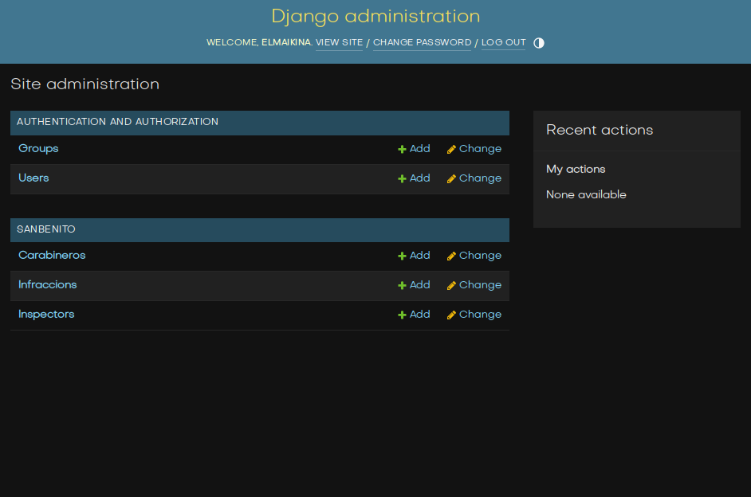

# Grupo Git.gud

Este es el repositorio del *Git.gud*, cuyos integrantes son:

* Integrante 1 - Vicente Alvear
* Integrante 2 - Jesús Escanilla
* Integrante 3 - Miguel Soto
* **Tutor**: Sebastián Cifuentes

## Front-End


## Back-End


# Instrucciones

A continuacion, las instrucciones de cómo hacer funcionar la aplicación.

## Como correr el backend
ejecutar el siguiente commando desde la carpeta _gitgud-san-benito/back_:
```
python manage.py runserver
```

## Como correr el frontend
ejecutar el siguiente commando desde la carpeta _gitgud-san-benito/front_:
```
npm start
```

## Wiki

> Obtener enlace desde el home de la wiki del repo.

Puede acceder a la Wiki mediante el siguiente [enlace](https://github.com/ElMaikina/utfsm-isw/wiki)

## Videos

> Reemplazar con los enlaces correspondientes

* Video presentación (1er Avance) [enlace](https://www.youtube.com/watch?v=Srpv72CV5yQ&feature=youtu.be)

* Video presentación (Hito 4) [enlace](https://youtu.be/ttK2AKOpbxQ)

## Aspectos técnicos relevantes

# Documentacion (Postman API)
[enlace](https://orange-sunset-482158.postman.co/workspace/c1b80694-4e82-4013-ad86-6f77a349bfa3)

